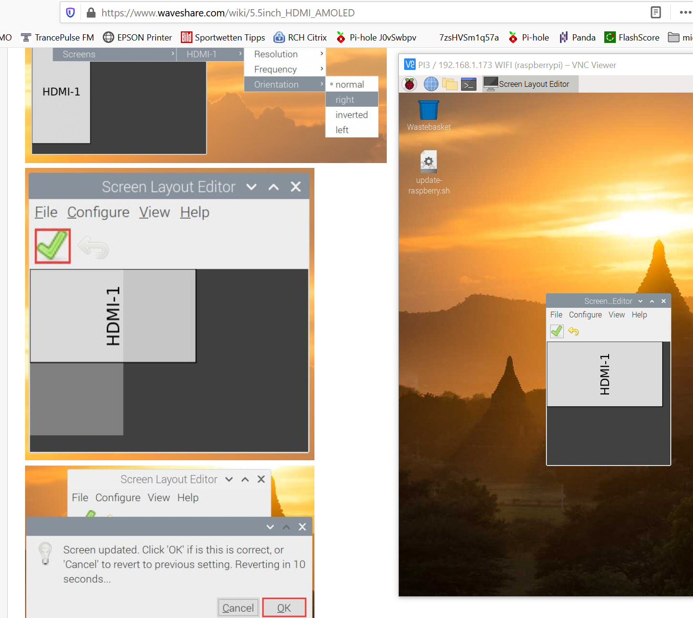

# Raspberry 3

## Setup 5.5'' Amoled Display
1. connect physically
2. start RPi - Display shows not a clear picture, it needs to be configured
3. Follow the instruction from here https://www.waveshare.com/wiki/5.5inch_HDMI_AMOLED connect via SSH, appended to /boot/config.txt
```
max_framebuffer_height=1920
max_usb_current=1
config_hdmi_boost=10
hdmi_group=2
hdmi_force_hotplug=1
hdmi_mode=87
hdmi_timings=1080 1 26 4 50 1920 1 8 2 6 0 0 0 60 0 135580000 3
dtoverlay=vc4-fkms-v3d
```
4. restart - OK
### install a screen saver
`sudo apt-get install xscreensaver`
### rotation settings
see also https://www.waveshare.com/w/upload/b/be/5.5inch_HDMI_AMOLED_User_Manual_EN.pdf  
append to /boot/config.txt  
`display_rotate=1 #1: 90; 2: 180; 3: 270` and reboot
and for touch rotating
NOTE: not working
```
sudo apt-get install xserver-xorg-input-libinput
sudo mkdir /etc/X11/xorg.conf.d
sudo cp /usr/share/X11/xorg.conf.d/40-libinput.conf /etc/X11/xorg.conf.d/
```
inside `/etc/X11/xorg.conf.d/40-libinput.conf`  
section `Identifier "libinput touchscreen catchall"` add  
`Option "CalibrationMatrix" "0 1 0 -1 0 1 0 0 1"`  
reboot  
not working  
change settings in "Raspimenu" -> "Preferences" -> "Screen Config"  
set Orientation to right
see 


## Install / Configure Internet Radio
Instructions from https://www.reichelt.de/magazin/how-to/kodi-internetradio/  
```
sudo apt-get update
sudo apt-get upgrade
sudo apt-get install kodi
sudo reboot
```


## Network Setup Moosstrasse 11
<li>eth0: 192.168.1.5
<li>wlan: 192.168.1.173